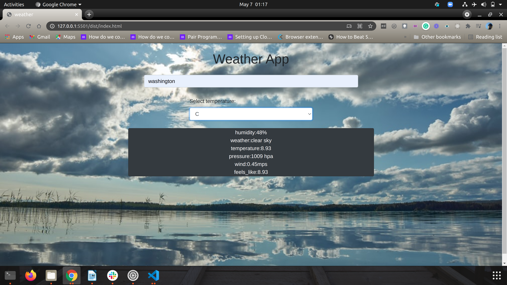

# weather-app

The Weather App project comes at the end of the Asynchronous Javascript and APIs section of the Javascript course. It is about asynchronous communication with promises or async/await and when to use them.

 ## Description
 It introduces everything to create a weather forecast site using the weather API.You should be able to search for a specific location and toggle displaying the data in Fahrenheit or Celsius.
 

## Built With

## Live Demo
https://dibdas.github.io/weather-app/

## Getting Started - Set Up

To set up a local copy of the project

1. `Run git clone https://github.com/dibdas/weather-app.git in the terminal`
2. `cd weather-app`
3.  Install dependencies by typing `npm install`
5.  Open your browser
6.  Navigate into the `dist` directory and open `index.html`

## Authors

👤 **Dibyendu Das**
- Github: [@dibdas](https://github.com/dibdas)
- Twitter: [@dibyend78120480](https://twitter.com/dibyend78120480)
- Linkedin: [Dibyendu Das](https://www.linkedin.com/in/dibdas/)

## 🤝 Contributing

Contributions, issues, and feature requests are welcome!

## Show your support

Give a ⭐️ if you like this project!

## Acknowledgments

- To Microverse for their `README` template.
